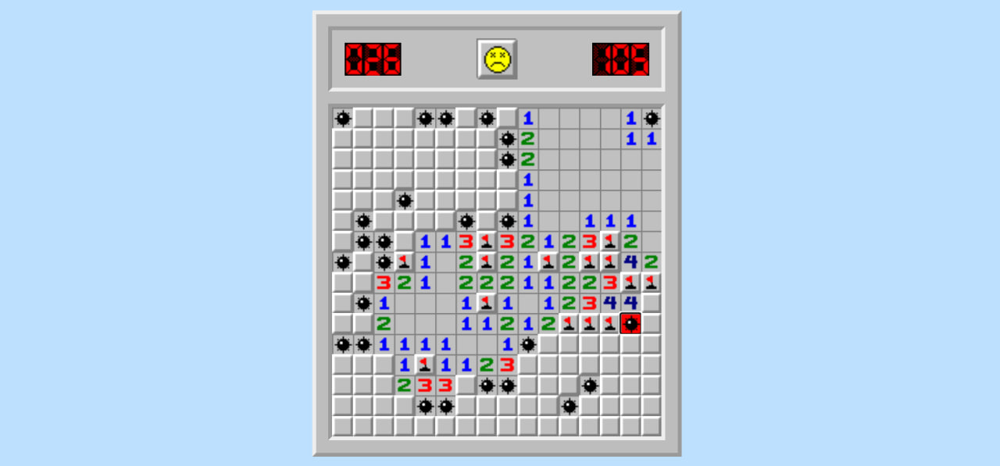

# Сапер

[Игра тут](https://deathstrouke.github.io/VK-Frontend-Task/)



## Описание

Игра сапер со стандартными правилами. Нажатие на поле ЛКМ открывает его. Нажатие ПКМ (долгое нажатие на мобильных
устройствах) ставит флажок, повторное нажатие ставит знак вопроса. Цель игры разминировать все поле.

## Инструкция по запуску

1. Склонируй этот репозиторий

```sh
   git clone https://github.com/DEATHSTROUKE/VK-Frontend-Task
```

2. Открой файл `src/index.html`

## Привнесенные доработки

**Дизайн:** подходящий задний фон, игровое поле с рамками, как в оригинальном сапере на чистом css

**Адаптивность под мобильные устройства:** игра полностью доступна на мобильных устройствах с шириной экрана от 360px.
Для установки флага
используется долгое нажатие. Самое то, для поездок в метро

**Эффект открытия клеток при перемещении мышки с зажатой клавишей:** просто залипательный эффект

**Предзагрузка изображений для оптимизации:** может показаться несущественным, но при смене картинок в игре возникал
неприятный эффект мелькания

## Проблемы с которыми столкнулся

- Safari на ios добаляет свои действия вроде увеличения при двойном нажатии, выделения поля и других. Не уверен, что все
  из них до конца решены, так как не имею доступа к этому браузеру.
- Планировал переписать код в ООП парадигме, но не успел
- Столкнулся с тем, что нет события для долгого нажатия. Пока искал как сделать, нашел поле timeStamp у события и по
  разнице этого параметра у события нажатия и отпускания смог вычислить длительность нажатия. Подобного решения нигде не
  видел, все что попадались были через setTimeout
- Было несколько багов связанных с одновременным нажатием правой и левой кнопки мыши, пришлось это учитывать
- Учет выхода курсора за границу поля, при ведении по клеткам